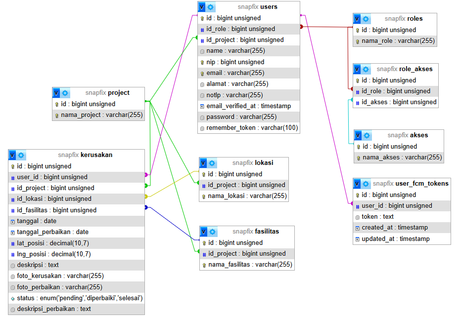

  

# 🖥️ SnapFix - RESTful API Backend

> **SnapFix Backend** adalah core engine berbasis RESTful API yang melayani sistem pelaporan kerusakan infrastruktur secara *real-time*. Backend ini dirancang dengan arsitektur terpisah untuk memproses, memvalidasi, dan menyediakan layanan data yang aman bagi aplikasi Mobile Client (Flutter).

---

## 🛠️ Tech Stack & Arsitektur

- **Core Framework:** Laravel 11 (PHP 8.2+)
- **Database:** MySQL
- **Authentication:** JWT (JSON Web Token) via `tymon/jwt-auth`
- **Architecture Pattern:** RESTful MVC 

---

## ✨ Fitur & Kapabilitas Backend

- 🔐 **Stateless JWT Authentication:** Menggunakan *JSON Web Token* untuk mengamankan komunikasi data antara aplikasi mobile dan server tanpa membebani session server (stateless).

---

## 🗺️ Relasi Antar Tabel (RAT)

Berikut adalah relasi antar tabel yang digunakan pada sistem SnapFix:

  

## 📑 Dokumentasi API Endpoint

Backend SnapFix menyediakan beberapa endpoint utama untuk kebutuhan operasional aplikasi mobile. Semua request setelah login memerlukan header `Authorization: Bearer <your_jwt_token>`.

> 💡 **API Collection:** Dikarenakan batasan limitasi cloud pada Postman, dokumentasi API disediakan dalam bentuk file JSON offline yang dapat langsung Anda impor ke Postman.
> 
> File collection dapat diakses di: **[routes/postman/SnapFix.postman_collection.json](./routes/postman/SnapFix.postman_collection.json)** 

---

## 🧪 Pengujian (Testing)

Proyek ini menerapkan **Automated Feature Testing** bawaan Laravel. Pengujian ini difokuskan untuk memastikan semua fungsionalitas API berjalan sesuai spesifikasi, dan mengembalikan *status code* HTTP yang tepat.

---
